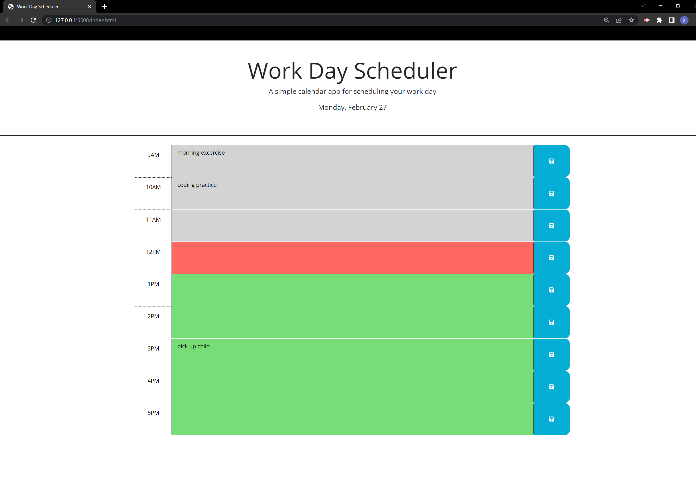

# Third-Party-APIs_Work-Day-Scheduler

## Description

This is a daily-planner application. Users can add important events for each of standard business hours (9am-5pm) of the day. The importamt events can be saved for later review. Indicated by colors of the timeblocks, users can tell whether an important event is in the past, presenet, or future.

## Installation

N/A

## Usage

* When users open the planner, the current day is displayed at the top of the calendar.

* When scrolling down, timeblocks for standard business hours are presented. The colors of the timeblocks indicate whether it is in the past (grey), present (red), or future(green).

* Users click into a timeblock to enter an event. By clicking the save button for that timeblock, the event is saved in local storage
and will persit after refreshing the page.

## Sreenshot

The following image demonstrates the application appearance:

## Link to the website

https://xybai0103.github.io/thirdPartyAPIs-workDayScheduler/

## Library used
* [jQuery](https://jquery.com/)
* [Day.js](https://day.js.org/en/)
* [Bootstrap](https://getbootstrap.com/)
* [Font Awesome](https://fontawesome.com/)
* [Google Fonts](https://fonts.google.com/)

## Credits

N/A

## Licencse

N/A